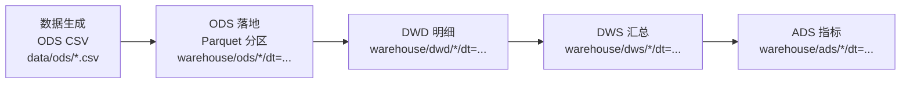

## 广告数仓离线项目（本地 Spark / Parquet / dt 分区目录）

## 1. 项目介绍

- **目标**：用本地 Spark（PySpark + Spark SQL/DF）实现一个贴合国内大数据/数仓岗位的广告数仓离线项目，分层 **ODS → DWD → DWS → ADS**。
- **存储**：统一使用 **Parquet**，用 `dt=YYYY-MM-DD` 的分区目录模拟 Hive 分区表。
- **特点**：内置一个明显“热点 campaign”（数据量远大于其它），用于演示广告场景常见的数据倾斜与治理。

## 2. 分层设计目的（ODS → DWD → DWS → ADS）

分层的核心价值是 **高内聚、低耦合**：
- **复用**：DWD/DWS 把公共口径沉淀下来，多个报表/应用（ADS）复用，避免每个需求都从事件级明细重复计算。
- **口径统一**：指标（例如 CTR/CVR/ROI）在 DWS/ADS 统一定义，避免“同名不同口径”。
- **抗变化**：上游字段/源表变化尽量局部消化在 ODS/DWD，不让变更层层扩散。

- **ODS（原始层）**：承接源数据，主要做类型标准化与分区落地，保证可追溯/可重跑。
- **DWD（明细层）**：对原始数据做清洗（去重、裁剪、时间标准化等），形成稳定的事实明细底座。
- **DWS（汇总层）**：面向分析域沉淀公共聚合（按天、按计划、按广告等），统一口径并降低下游计算成本。
- **ADS（应用层）**：面向消费端（日报、榜单、漏斗等）产出直接可用的报表数据。

## 3. 分层架构图



## 4. 目录结构

```text
.
├── data_generator/
│   └── generate_ads_ods.py
├── data/
│   └── ods/                    # ODS CSV（已 gitignore）
├── spark/
│   ├── common/
│   │   └── spark_session.py
│   └── jobs/
│       ├── 00_ingest_ods.py
│       ├── 01_build_dwd.py
│       ├── 02_build_dws.py
│       └── 03_build_ads.py
├── warehouse/                  # Parquet 落地（已 gitignore）
├── requirements.txt
└── README.md
```

## 5. 表清单（每层 2-3 张表：表名 / 粒度 / 用途）

### ODS（原始层）

- **ad_event_log**：曝光/点击事件日志（按 dt 分区）
  - **粒度**：`dt + event_id`
  - **用途**：事件级事实来源（曝光/点击），承接广告投放的主要行为数据
- **conversion_log**：转化日志（按 dt 分区）
  - **粒度**：`dt + conv_id`
  - **用途**：订单/GMV 的转化事实来源，支撑转化率与 ROI
- **ad_cost**：投放成本（按 dt+campaign_id 汇总，按 dt 分区）
  - **粒度**：`dt + campaign_id`
  - **用途**：成本侧口径（消耗），供 DWS/ADS 关联补齐 cost

### DWD（明细层）

- **dwd_ad_impression_detail**
  - **粒度**：`dt + event_id`
  - **用途**：曝光明细（去重、时间标准化、字段裁剪），复用到曝光侧各类分析
- **dwd_ad_click_detail**
  - **粒度**：`dt + event_id`
  - **用途**：点击明细（去重、时间标准化、字段裁剪），复用到点击侧分析与归因
- **dwd_ad_conversion_detail**
  - **粒度**：`dt + conv_id`
  - **用途**：转化明细（去重、时间标准化、GMV 类型统一），复用到转化/营收分析

### DWS（汇总层）

- **dws_ad_campaign_stats_1d**
  - **粒度**：`dt + campaign_id`
  - **用途**：计划日公共汇总（imps/clicks/convs/gmv/cost），支撑计划日报与看板
- **dws_ad_ad_stats_1d**
  - **粒度**：`dt + ad_id`
  - **用途**：广告日公共汇总（imps/clicks/convs/gmv），支撑广告维度分析与榜单

### ADS（应用层）

- **ads_campaign_daily_report**
  - **粒度**：`dt + campaign_id`
  - **用途**：计划日报（含 CTR/CVR/CPC/CPM/ROI/AOV）
- **ads_top_creatives_daily**
  - **粒度**：`dt + rank`
  - **用途**：Top10 创意榜（按 clicks 或 roi 排序；从 DWD 按 creative_id 聚合 + 简化归因）
- **ads_funnel_daily**
  - **粒度**：`dt`
  - **用途**：全站漏斗（imps → clicks → convs）

## 6. 指标口径（CTR/CVR/CPC/CPM/ROI）

- **CTR（Click Through Rate）**：\( CTR = \frac{clicks}{imps} \)
- **CVR（Conversion Rate, click→conv）**：\( CVR = \frac{convs}{clicks} \)
- **CPC（Cost Per Click）**：\( CPC = \frac{cost}{clicks} \)
- **CPM（Cost Per Mille）**：\( CPM = \frac{cost}{imps} \times 1000 \)
- **ROI（Return On Investment）**：\( ROI = \frac{gmv}{cost} \)

说明：分母为 0 时指标记为 `NULL`（避免除零带来的无意义数值）。

## 7. 数据倾斜：广告场景为什么常见 & 项目里怎么处理

### 7.1 为什么广告数据倾斜很常见

广告业务天然符合“二八分布/长尾分布”：
- 少数 **热点 campaign/creative** 承接了大部分曝光与点击（爆款素材、加大预算、平台流量倾斜）。
- 头部媒体/点位流量集中，进一步放大某些 key 的数据量。

在 Spark 里表现为：聚合/Join 的某些 key 数据量极大，容易产生 **straggler**（拖后腿的任务），导致作业整体被最慢的分区决定。

### 7.2 本项目的处理方法（可面试讲解）

- **salting + 两阶段聚合（已实现）**
  - 位置：`spark/jobs/02_build_dws.py`
  - 思路：对热点 key（例如 `campaign_id=cmp_hot_0001`）加盐 `_salt`，把一个大 group 拆成 N 个小 group 并行做局部聚合，再二次汇总回原 key。
  - 收益：拆分热点、降低单点聚合压力，显著减少拖尾。
- **broadcast join（已实现/可选）**
  - 位置：`spark/jobs/02_build_dws.py` 将 `ad_cost` 作为小表广播 join（避免大表 join 触发 shuffle）。
  - 场景：小表（维表/成本表/字典表）+ 大表 join 时常用。
- **AQE（已开启）**
  - 位置：`spark/common/spark_session.py` 已开启 AQE（自适应执行：分区合并、skew join 等）。
  - 收益：根据运行时统计信息动态优化执行计划，提升整体稳定性与性能。

## 8. 运行步骤（从生成数据到产出 ADS）

### 8.1 安装依赖

```bash
python -m venv .venv
source .venv/bin/activate
pip install -r requirements.txt
```

### 8.2 生成 ODS CSV（至少 3 天）

```bash
python data_generator/generate_ads_ods.py --start_dt 2026-03-01 --days 3
```

### 8.3 ODS 落地（CSV → Parquet 分区表）

```bash
PYTHONPATH=. python spark/jobs/00_ingest_ods.py
```

### 8.4 构建 DWD 明细（ODS → DWD）

```bash
PYTHONPATH=. python spark/jobs/01_build_dwd.py
```

### 8.5 构建 DWS 汇总（DWD → DWS，含倾斜处理）

```bash
PYTHONPATH=. python spark/jobs/02_build_dws.py --num_salts 16
```

### 8.6 构建 ADS 报表（DWS/DWD → ADS）

```bash
PYTHONPATH=. python spark/jobs/03_build_ads.py
```

一键跑通（从 0 到 ADS）：

```bash
python data_generator/generate_ads_ods.py --start_dt 2026-03-01 --days 3 \
&& PYTHONPATH=. python spark/jobs/00_ingest_ods.py \
&& PYTHONPATH=. python spark/jobs/01_build_dwd.py \
&& PYTHONPATH=. python spark/jobs/02_build_dws.py --num_salts 16 \
&& PYTHONPATH=. python spark/jobs/03_build_ads.py --top_n 10 --rank_by clicks
```

## 9. 数据落地目录约定（模拟 Hive 分区）

```text
warehouse/
  ods/ad_event_log/dt=YYYY-MM-DD/part-*.parquet
  ods/conversion_log/dt=YYYY-MM-DD/part-*.parquet
  ods/ad_cost/dt=YYYY-MM-DD/part-*.parquet
  dwd/dwd_ad_impression_detail/dt=YYYY-MM-DD/part-*.parquet
  dwd/dwd_ad_click_detail/dt=YYYY-MM-DD/part-*.parquet
  dwd/dwd_ad_conversion_detail/dt=YYYY-MM-DD/part-*.parquet
  dws/dws_ad_campaign_stats_1d/dt=YYYY-MM-DD/part-*.parquet
  dws/dws_ad_ad_stats_1d/dt=YYYY-MM-DD/part-*.parquet
  ads/ads_campaign_daily_report/dt=YYYY-MM-DD/part-*.parquet
  ads/ads_top_creatives_daily/dt=YYYY-MM-DD/part-*.parquet
  ads/ads_funnel_daily/dt=YYYY-MM-DD/part-*.parquet
```

## 10. 示例查询（spark.sql）

在项目根目录执行下面这段脚本（会读取 Parquet 并用 SQL 查询）：

```bash
PYTHONPATH=. python - <<'PY'
from pyspark.sql import SparkSession

spark = (
    SparkSession.builder
    .appName("ads_sql_demo")
    .master("local[*]")
    .getOrCreate()
)

spark.read.parquet("warehouse/ads/ads_campaign_daily_report").createOrReplaceTempView("ads_campaign_daily_report")
spark.read.parquet("warehouse/ads/ads_top_creatives_daily").createOrReplaceTempView("ads_top_creatives_daily")
spark.read.parquet("warehouse/ads/ads_funnel_daily").createOrReplaceTempView("ads_funnel_daily")

dt = "2026-03-01"

print("=== campaign daily report (top by clicks) ===")
spark.sql(f"""
select dt,campaign_id,imps,clicks,convs,gmv,cost,ctr,cvr,cpc,cpm,roi,aov
from ads_campaign_daily_report
where dt = '{dt}'
order by clicks desc
limit 10
""").show(truncate=False)

print("=== top creatives daily ===")
spark.sql(f"""
select dt,rank,creative_id,clicks,ctr,convs,cvr
from ads_top_creatives_daily
where dt = '{dt}'
order by rank asc
""").show(truncate=False)

print("=== funnel daily ===")
spark.sql("""
select *
from ads_funnel_daily
order by dt asc
""").show(truncate=False)

spark.stop()
PY
```

## 11. 结果展示（ads_campaign_daily_report 截图占位）

把 `ads_campaign_daily_report` 的查询结果截图放到下面路径即可（占位）：

```text
docs/screenshots/ads_campaign_daily_report_sample.png
```


## 12. 后续可扩展方向（留给你后续 prompt 驱动）

- **更真实的业务口径**：如曝光去重、点击归因、转化窗口、投放状态变更、预算消耗逻辑等。
- **慢变维（SCD）**：将 `campaign` 维度做成拉链表（SCD2）。
- **更多维度**：媒体/计划/单元/创意、地域、设备、用户画像等。
- **质量与治理**：主键唯一性、空值校验、异常值处理、对账/指标一致性校验。

